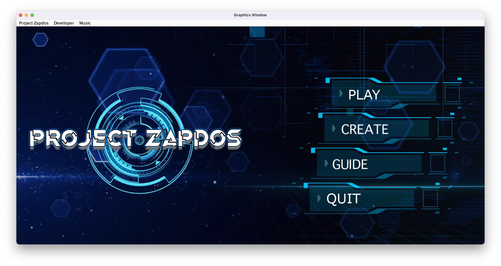
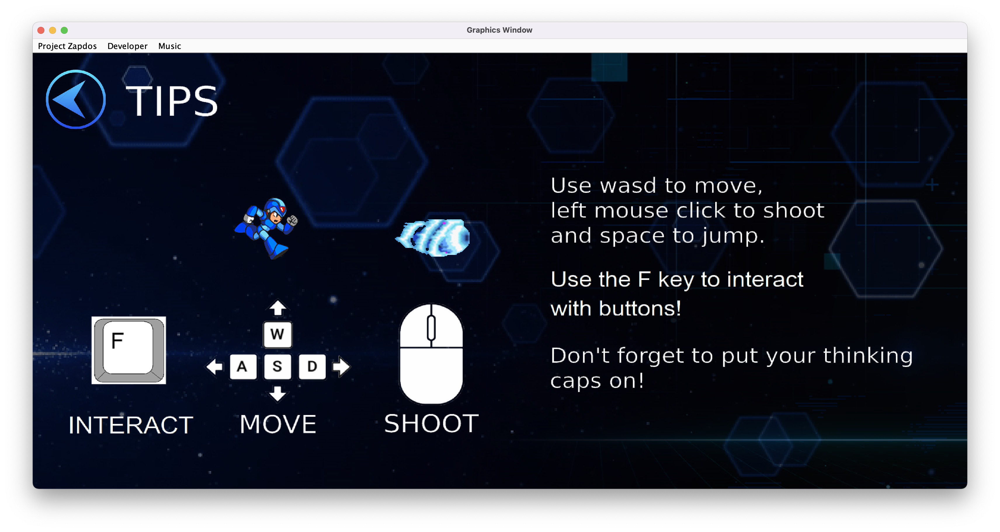
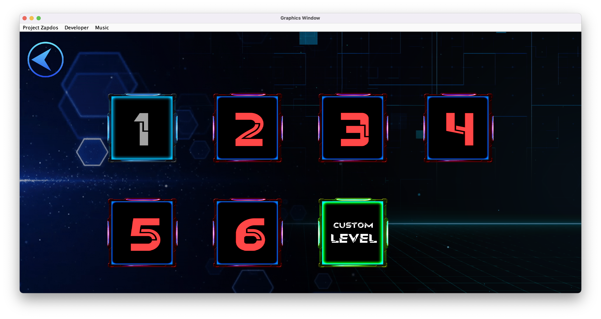
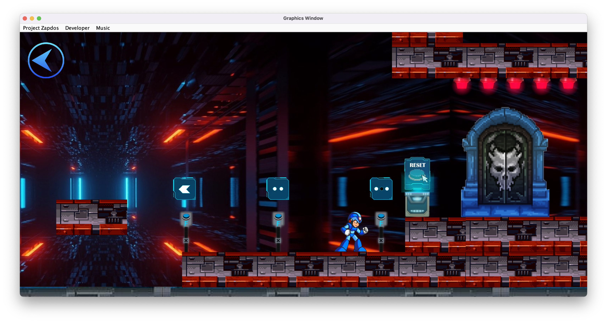
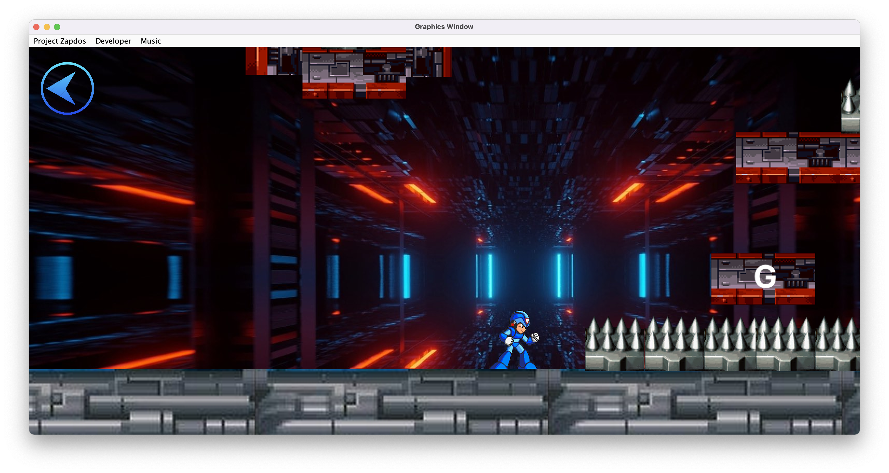
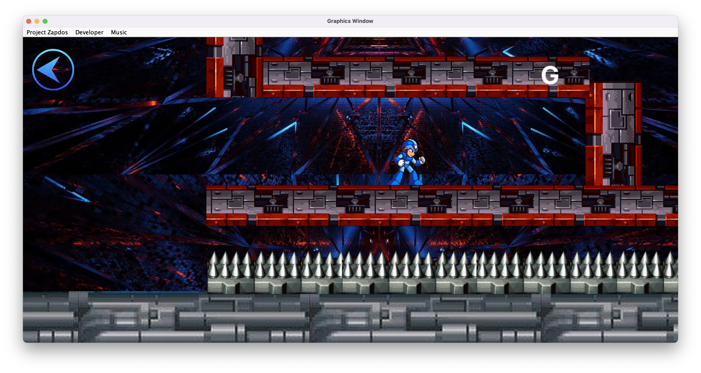
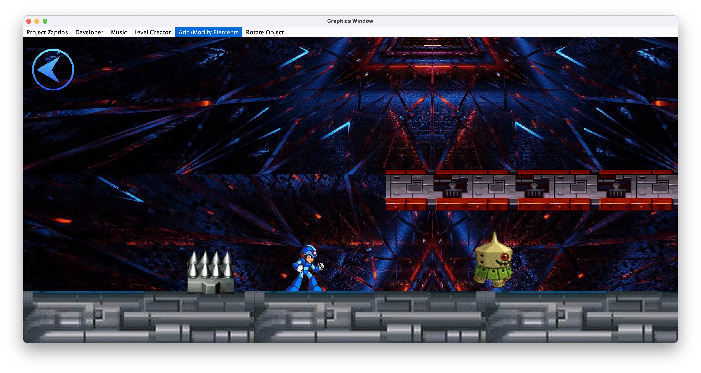

[![MIT License][license-shield]][license-url]
  

  
  
  
  #### A puzzle platformer built using Java
  
  <a href="https://github.com/comp129/customer-project-zapdos/blob/main/documentation/FinalProjectReport.md"><strong>Project Report » </strong></a> |
  <a href="https://github.com/comp129/customer-project-zapdos/blob/main/documentation/SprintLog.md"><strong>Sprint Log » </strong></a> |
  <a href="https://github.com/comp129/customer-project-zapdos/blob/main/documentation/TechDebt.md"><strong>Technical Debt » </strong></a> |
  <a href="https://github.com/comp129/customer-project-zapdos/blob/main/documentation/CustomerNotes.md"><strong>Customer Notes » </strong></a> 
   
  
 [Releases](https://github.com/comp129/customer-project-zapdos/releases) |
 [Issues](https://github.com/comp129/customer-project-zapdos/issues) |
 [Pull Requests](https://github.com/comp129/customer-project-zapdos/pulls)
  

<!-- TABLE OF CONTENTS -->

  
Table of Contents

  - [About The Project](#about-the-projec)
    - [Built With](#built-with)
  - [Getting Started](#getting-started)
  - [UI](#ui)
  - [License](#license)
  - [Contact](#contact)
  - [Acknowledgments](#acknowledgments)

<!-- ABOUT THE PROJECT -->
## About The Project
Project Zapdos is a 2D puzzle platformer. Players can play through various levels, shoot enemies, and solve puzzles. Players can even create their own levels and play them!

 

### Built With 
[![Java 11][java-shield]][java-url]
[![Eclipse][eclipse-shield]][eclipse-url]
[![Gradle][gradle-shield]][gradle-url]

<!-- GETTING STARTED -->

## Getting Started
### Prerequsites

[![Java 11][java-shield]][java-url]

### Setup
1) Clone this repo
2) Open the repo folder in Eclipse
3) Run MainApplication.java

**In-app**
Once the user launches the application, clicking on the play button will navigate the player to the Stage Select Screen, whereby clicking on stage one will load the player into the first stage. 

The player must use the keyboard keys: w, a, s, d, space, f to manipulate the player and access the player mechanics, along with clicking the left-mouse button to shoot projectiles. 

## UI

  
  
  
  
  
  
  

<!-- LICENSE -->
## License

Distributed under the MIT License. See `LICENSE.txt` for more information.

<!-- Contact -->
## Contact

* Bikram Chatterjee - b_chatterjee@u.pacific.edu
* Vijay Kumar
* Jordan Sommers
* Shahbaj Sohal

<!-- Acknowledgments -->
## Acknowledgments
* [Choosing an Open Source License](https://choosealicense.com)
* [How To Run Eclipse Under Different Version of JDK or JRE](https://mail.codejava.net/ides/eclipse/how-to-run-eclipse-under-different-version-of-jdk-or-jre)
* [How To Automatically Generate A Helpful Changelog From Your Git Commit Messages](https://mokkapps.de/blog/how-to-automatically-generate-a-helpful-changelog-from-your-git-commit-messages/)
* [How To lint Git commit messages](https://remarkablemark.org/blog/2019/05/29/git-husky-commitlint/)
* [Standard Version](https://github.com/conventional-changelog/standard-version)
* [Img Shields](https://shields.io)
* [Gradle Compatibility](https://docs.gradle.org/current/userguide/compatibility.html)
* [Java Platform, Standard Edition 15 Reference](https://jdk.java.net/java-se-ri/15)
* [JDK 11](https://openjdk.java.net/projects/jdk/11/)

      
    Made with ❤️ by Zapdos

[license-shield]: https://img.shields.io/github/license/othneildrew/Best-README-Template.svg?style=for-the-badge
[license-url]: https://github.com/comp129/customer-project-zapdos/blob/master/LICENSE
[java-shield]: https://img.shields.io/badge/java-11-red.svg?style=for-the-badge&logo=appveyor
[java-url]: https://www.oracle.com/java/technologies/javase/jdk11-archive-downloads.html
[eclipse-shield]: https://img.shields.io/badge/eclipse-blue.svg?style=for-the-badge&logo=appveyor
[eclipse-url]: https://www.eclipse.org
[gradle-shield]: https://img.shields.io/badge/gradle-grey.svg?style=for-the-badge&logo=appveyor
[gradle-url]: https://gradle.org

